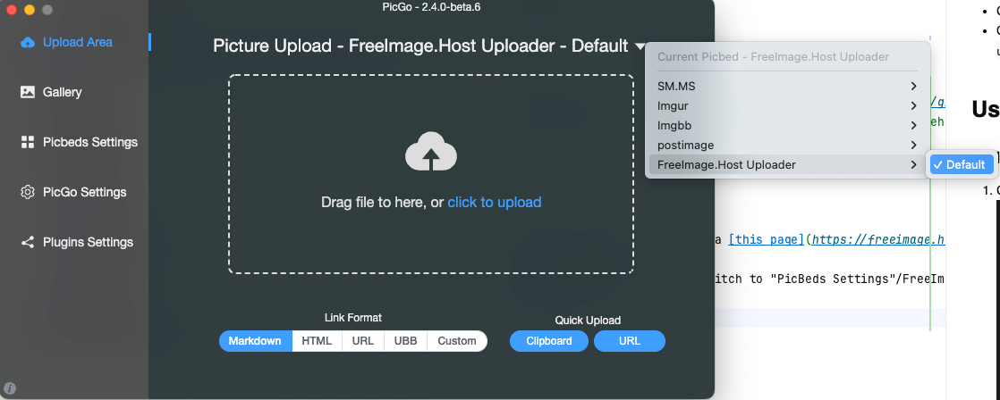

## picgo-plugin-freeimagehost-uploader

A PicGo uploader for [freeimage.host](https://freeimage.host)

[中文文档](README.zh-cn.md)

## Install

- GUI: Search `freeimagehost` in main window of [PicGo](https://github.com/Molunerfinn/PicGo) and install it
- CLI: Install via command `picgo install picgo-plugin-freeimagehost-uploader`

## Usage

### GUI

1. Get freeimage.host API KEY via [this page](https://freeimage.host/page/api)
   
2. Open main window of PicGo, Switch to "PicBeds Settings"/FreeImage.Host and enter API key got before here.
   
3. Switch the default uploader to FreeImageHost Uploader
   

### CLI

Figure it out yourself as you are already a cli-user :P