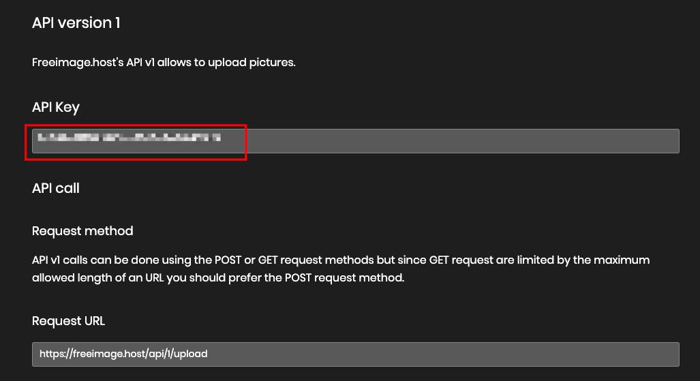
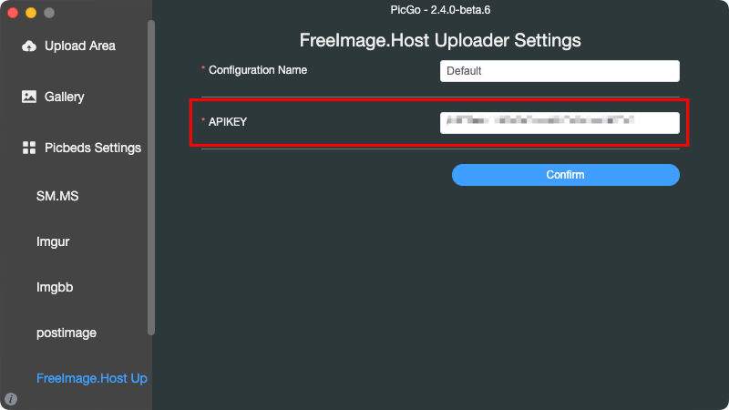
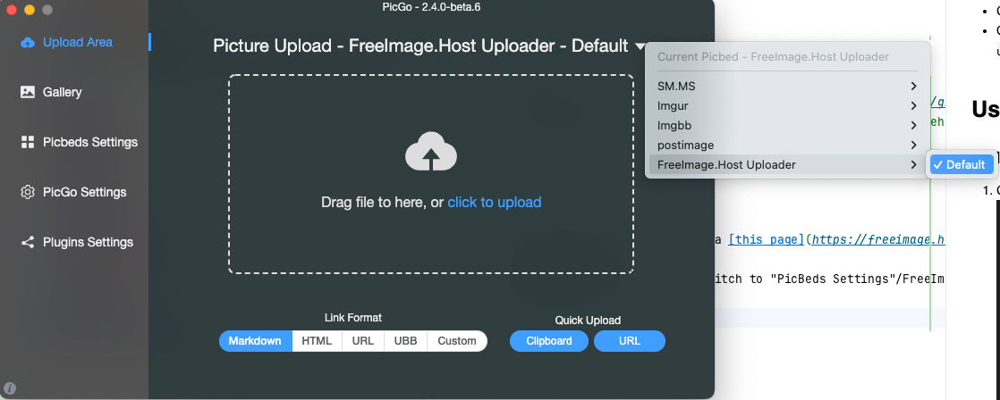

## picgo-plugin-freeimagehost-uploader

一个PicGo插件，支持[freeimage.host](https://freeimage.host)图床

## 安装

- GUI: 打开 [PicGo] 主窗口，选择插件设置，并在内搜索 `freeimagehost` 并安装
- CLI: 命令行内执行 `picgo install picgo-plugin-freeimagehost-uploader`

## 设置

1. 从[这个网页](https://freeimage.host/page/api)获取API
   
2. 打开PicGo主窗口，在图床设置下找到 `FreeImage.Host`，在内输入刚才获得的 API KEY
   
3. 在 `上传区` 选择 `FreeImage.Host` 为默认图床，开始上传！
   